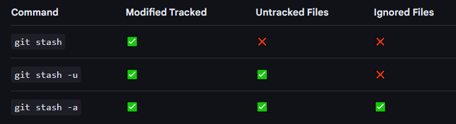

## Merge and REBASE  
*Always checkout the branch you want to keep updated,
then merge the other branch into it.*  
**`git merge branch2`  
means “Add everything from branch2 into my current branch** 

---
### Merge
```
git merge <branch>
```
- it merge history, so logs will become messy (Combines histories, Creates a merge commit)
- when check `git log` it will show in timestep order
- but it does not mean it is linear, it is in graph manner {Keeps original commit structure (DAG)}

**For checking graph use this command:**  
`git log --graph --oneline --decorate --all`

---
### Rebase
```
git rebase  <branch>
```
- it rewrite commit history and Creates new commit hashes
- by that it create Clean, linear history

---
## Pull Rebase
```
git pull --rebase origin main
```
- pull --rebase = fetch + rebase (instead of fetch + merge)
- Used on feature/child branches, not on main
Purpose: update your branch with latest main before pushing/PR
- Produces clean linear history (no merge commits)
- Rewrites your local commits on top of new remote commits
- After rebase, force-push is required `git push --force-with-lease`
- Avoids useless “merge commits” created by normal git pull
- Lets you resolve conflicts locally, not in PR/GitHub UI
- Safe only for unshared local commits
- Do NOT rebase public/shared history

## Pull and fetch
```
git pull
```
`git pull = fetch + merge`
- it fetch all commit and data and then merge it with currunt branch 
- used to bring all currunt code from remote repo

---
```
git fetch
```
- Fetches new commits and data from the remote repository but does not change/affect on going working directory and current branch 
- Check latest commits on the remote
- Compare code before merging (git diff)
- Review history safely (git log)

## cherry-pick
```
git checkout main
git cherry-pick <hash-1> <hash-2>
```
- Copy specific commit(s) from one branch to another
- Instead of merging whole branches, cherry-pick lets you pick only the commits you want.
- in above example we are merging commit 1 and 2 into main branch 

#### "ranges" in cherry-pick
- selecting and applying a sequence of consecutive commits from one branch to another
- include "^.." between to hash id, it will bring all commit changes in working branch 
```
git cherry-pick <hash-A>^..<hash-D>
```


## stash
```
git stash
```
- temporarily save uncommitted changes without committing them. (modified tracked files only, not untracked file)  

View list of stashes
```
git stash list
```
restore specific stash

```
git stash apply stash@{1}
```

After apply, remove stash
```
git stash drop "stahs@{0}"

or for clear all

git stash clear
```

Stash with a Message
```
git stash push -m "fix login ui"
```

---
Stash Untracked Files
```
git stash -u

or

git stash --include-untracked
```
Stash Ignored + Untracked
```
git stash -a

or

git stash --all
```




## diff 
- Compare differences between states of the project  
- Diff is only for viewing changes — nothing is created or applied.

View unstaged changes
```
git diff
```
View staged vs last commit
```
git diff --cached
```
Compare commits
```
git diff <commit1> <commit2>

```
Compare branches
```
git diff main..test
```
Compare working directory with remote branch
```
git diff origin/main
```


## patch

Patch = exported diff that can be applied later.

Create patch from last commit
```
git format-patch -1 <commit-hash>
```

Create patch for range of commits
```
git format-patch <old-commit>..<new-commit>
```

Create patch for branch differences
```
git format-patch main..test
```

Apply patch
```
git apply file.patch
```

Apply patch with commit metadata (author, message, etc.)
```
git am file.patch
```